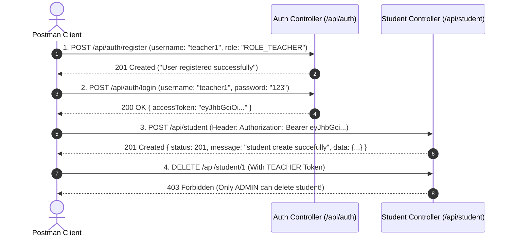

# 🎓 Student REST API Security Implementation Guide (`Security-student-api.md`)

> **Project Name:** RestApi-P1  
> **Target API:** Student Management REST API (`/api/student`)  
> **Status:** Architecture & Implementation Blueprint (No Code Touched)  

---

## 📌 Table of Contents
1. [🎯 Student API Project Ke Liye Security Kyun Zaroori Hai?](#1--student-api-project-ke-liye-security-kyun-zaroori-hai)
2. [🔑 Roles & Endpoint Authorization Matrix](#2--roles--endpoint-authorization-matrix)
3. [🏗️ Database Schema & Domain Layer Architecture](#3-️-database-schema--domain-layer-architecture)
4. [📁 Proposed Security Package Structure](#4--proposed-security-package-structure)
5. [🛠️ Step-by-Step Implementation Blueprint for Student API](#5-️-step-by-step-implementation-blueprint-for-student-api)
   - [Step 1: `pom.xml` Dependencies Add Karna](#step-1-pomxml-dependencies-add-karna)
   - [Step 2: User Domain & Roles Setup](#step-2-user-domain--roles-setup)
   - [Step 3: Security & JWT Infrastructure Components](#step-3-security--jwt-infrastructure-components)
   - [Step 4: Spring Security Configuration (`SecurityConfig`)](#step-4-spring-security-configuration-securityconfig)
   - [Step 5: Authentication DTOs & AuthController](#step-5-authentication-dtos--authcontroller)
   - [Step 6: Existing `StudentController` Ko Protect Karna (@PreAuthorize)](#step-6-existing-studentcontroller-ko-protect-karna-preauthorize)
6. [🧪 Postman Testing Flow for Secured Student API](#6--postman-testing-flow-for-secured-student-api)
7. [💡 Checklist & Summary](#7--checklist--summary)

---

<a name="1--student-api-project-ke-liye-security-kyun-zaroori-hai"></a>
## 1. 🎯 Student API Project Ke Liye Security Kyun Zaroori Hai?

Aapke current `RestApi-P1` project me `/api/student` ke neeche basic CRUD operations implemented hain:
- `POST /api/student` (Save new student)
- `GET /api/student/{id}` (Fetch student by ID)
- `GET /api/student` (Fetch all students)
- `PUT /api/student/{id}` (Update student details)
- `DELETE /api/student/{id}` (Delete student record)

### ❌ Abhi Is API Me Kya Problem Hai?
1. **Unrestricted Access:** Koi bhi unknown user ya hacker `DELETE /api/student/1` hit karke student ka record erase kar sakta hai.
2. **Data Manipulation:** Koi bhi student doosre student ke marks ya email modify (`PUT`) kar sakta hai.
3. **No Ownership / Identity:** Server ko pata nahi chalta ki request kisne bheji hai (Student, Teacher, ya Principal/Admin).

### ✅ Security Lagane Ke Baad Kya Hoga?
- **Authentication (JWT):** User ko pehle `/api/auth/login` karke JWT token lena hoga.
- **Authorization (RBAC):**
  - **Student:** Apne aur sabhi students ke records **view (`GET`)** kar sakta hai.
  - **Teacher:** New student **create (`POST`)** aur **update (`PUT`)** kar sakta hai.
  - **Admin (Principal):** Student ko **delete (`DELETE`)** karne ke full rights rakhta hai.

---

<a name="2--roles--endpoint-authorization-matrix"></a>
## 2. 🔑 Roles & Endpoint Authorization Matrix

Aapke Student API ke har endpoint ke liye permission rules neeche diye gaye hain:

| HTTP Method | Endpoint URL | Description | Minimum Allowed Role | Authorization Code Rule |
| :---: | :--- | :--- | :---: | :--- |
| `POST` | `/api/auth/register` | User Signup | Public (No Auth) | `.permitAll()` |
| `POST` | `/api/auth/login` | User Login & Get JWT | Public (No Auth) | `.permitAll()` |
| `GET` | `/api/student` | Get All Students List | `ROLE_STUDENT`, `ROLE_TEACHER`, `ROLE_ADMIN` | `@PreAuthorize("hasAnyRole('STUDENT', 'TEACHER', 'ADMIN')")` |
| `GET` | `/api/student/{id}` | Get Student By ID | `ROLE_STUDENT`, `ROLE_TEACHER`, `ROLE_ADMIN` | `@PreAuthorize("hasAnyRole('STUDENT', 'TEACHER', 'ADMIN')")` |
| `POST` | `/api/student` | Create New Student | `ROLE_TEACHER`, `ROLE_ADMIN` | `@PreAuthorize("hasAnyRole('TEACHER', 'ADMIN')")` |
| `PUT` | `/api/student/{id}` | Update Student Details | `ROLE_TEACHER`, `ROLE_ADMIN` | `@PreAuthorize("hasAnyRole('TEACHER', 'ADMIN')")` |
| `DELETE` | `/api/student/{id}` | Delete Student Record | `ROLE_ADMIN` Only | `@PreAuthorize("hasRole('ADMIN')")` |

---

<a name="3-️-database-schema--domain-layer-architecture"></a>
## 3. 🏗️ Database Schema & Domain Layer Architecture

Existing `student` table ke sath security ke liye 2 nayi tables add hongi:

```
[users] ──< (1:N) >── [user_roles]
                             │
                             └── (Role Strings: 'ROLE_STUDENT', 'ROLE_TEACHER', 'ROLE_ADMIN')

[student] ── (Optionally linked via user_id to track which user belongs to which student profile)
```

---

<a name="4--proposed-security-package-structure"></a>
## 4. 📁 Proposed Security Package Structure

Project ke `com.example.restapi` package me security introduce karne ke baad package layout aisa dikhega:

```text
com.example.restapi
├── config
│   ├── PasswordConfig.java               # BCryptPasswordEncoder Bean
│   └── SecurityConfig.java               # SecurityFilterChain, CORS, Session Management
├── controller
│   ├── AuthController.java               # /api/auth/login & /api/auth/register
│   └── StudentController.java            # Protected with @PreAuthorize
├── dto
│   ├── request
│   │   ├── LoginRequestDto.java          # Username & Password payload
│   │   ├── RegisterRequestDto.java       # User registration payload
│   │   └── StudentRequestDto.java        # Existing Student DTO
│   └── response
│       ├── ApiResponse.java              # Existing Response Wrapper
│       ├── JwtAuthResponseDto.java       # Access Token response
│       └── StudentResponseDto.java       # Existing Student DTO
├── entity
│   ├── Role.java                         # Enum (ROLE_STUDENT, ROLE_TEACHER, ROLE_ADMIN)
│   ├── Student.java                      # Existing Student Entity
│   └── User.java                         # User Authentication Entity
├── repository
│   ├── StudentRepository.java            # Existing Student Repo
│   └── UserRepository.java               # User Lookup by Username/Email
└── security
    ├── CustomUserDetailsService.java     # Loads user & roles from DB for Spring Security
    ├── JwtAuthenticationEntryPoint.java  # Handles 401 Unauthorized JSON response
    ├── JwtAuthenticationFilter.java      # Intercepts requests & validates Bearer JWT Token
    └── JwtTokenProvider.java             # Generates, parses, & verifies JWT tokens
```

---

<a name="5-️-step-by-step-implementation-blueprint-for-student-api"></a>
## 5. 🛠️ Step-by-Step Implementation Blueprint for Student API

Jab aap code implement karne bolenge, toh is blueprint step-by-step sequence ko follow kiya jayega:

---

### Step 1: `pom.xml` Dependencies Add Karna
`pom.xml` me Spring Security aur JJWT libraries add ki jayengi:

```xml
<!-- Spring Security -->
<dependency>
    <groupId>org.springframework.boot</groupId>
    <artifactId>spring-boot-starter-security</artifactId>
</dependency>

<!-- JJWT (Java JWT) -->
<dependency>
    <groupId>io.jsonwebtoken</groupId>
    <artifactId>jjwt-api</artifactId>
    <version>0.12.5</version>
</dependency>
<dependency>
    <groupId>io.jsonwebtoken</groupId>
    <artifactId>jjwt-impl</artifactId>
    <version>0.12.5</version>
    <scope>runtime</scope>
</dependency>
<dependency>
    <groupId>io.jsonwebtoken</groupId>
    <artifactId>jjwt-jackson</artifactId>
    <version>0.12.5</version>
    <scope>runtime</scope>
</dependency>
```

---

### Step 2: User Domain & Roles Setup

#### A. Role Enum (`com.example.restapi.entity.Role`)
```java
package com.example.restapi.entity;

public enum Role {
    ROLE_STUDENT,
    ROLE_TEACHER,
    ROLE_ADMIN
}
```

#### B. User Entity (`com.example.restapi.entity.User`)
```java
package com.example.restapi.entity;

import jakarta.persistence.*;
import java.util.HashSet;
import java.util.Set;

@Entity
@Table(name = "users")
public class User {

    @Id
    @GeneratedValue(strategy = GenerationType.IDENTITY)
    private Long id;

    @Column(nullable = false, unique = true)
    private String username;

    @Column(nullable = false, unique = true)
    private String email;

    @Column(nullable = false)
    private String password;

    @ElementCollection(fetch = FetchType.EAGER)
    @CollectionTable(name = "user_roles", joinColumns = @JoinColumn(name = "user_id"))
    @Enumerated(EnumType.STRING)
    @Column(name = "role")
    private Set<Role> roles = new HashSet<>();

    // Constructors, Getters & Setters
}
```

---

### Step 3: Security & JWT Infrastructure Components

#### A. `JwtTokenProvider.java`
- `generateToken(Authentication authentication)`: User ke authorities aur username se 24-hour expiration ka signed JWT token banata hai.
- `getUsernameFromJWT(String token)`: Token ke payload claim se username extract karta hai.
- `validateToken(String token)`: Signature checking aur expiration validation karta hai.

#### B. `JwtAuthenticationFilter.java`
- Incoming HTTP requests ke `Authorization` header se `Bearer <jwt_token>` parse karta hai.
- Token valid hone par `CustomUserDetailsService` se user rules fetch karke Spring Context (`SecurityContextHolder`) me set karta hai.

---

### Step 4: Spring Security Configuration (`SecurityConfig`)

Spring Boot 3/4 ke `SecurityFilterChain` Bean me student endpoints authorize kiye jayenge:

```java
@Configuration
@EnableMethodSecurity
public class SecurityConfig {

    @Bean
    public SecurityFilterChain securityFilterChain(HttpSecurity http) throws Exception {
        http
            .csrf(csrf -> csrf.disable()) // REST APIs me CSRF disable karte hain
            .sessionManagement(session -> session.sessionCreationPolicy(SessionCreationPolicy.STATELESS))
            .authorizeHttpRequests(authorize -> authorize
                .requestMatchers("/api/auth/**").permitAll() // Login/Signup open
                .anyRequest().authenticated()
            );

        http.addFilterBefore(jwtAuthenticationFilter, UsernamePasswordAuthenticationFilter.class);
        return http.build();
    }
}
```

---

### Step 5: Authentication DTOs & AuthController

New endpoints for Authentication:
- `POST /api/auth/register`: Student ya Teacher account register karne ke liye.
- `POST /api/auth/login`: Account verify karke JWT Token (`accessToken`) return karne ke liye.

---

### Step 6: Existing `StudentController` Ko Protect Karna (@PreAuthorize)

Aapke existing [StudentController.java](file:///d:/Spring%20Boot%20prokject%20workspace/RestApi-P1/src/main/java/com/example/restapi/controller/StudentController.java) me code change kiye bina safety rules is tarah apply honge:

```java
@RestController
@RequestMapping("/api/student")
public class StudentController {

    private final StudentService studentService;
    // Constructor injection...

    // 1. READ ALL (Student, Teacher, Admin sabhi Padh sakte hain)
    @PreAuthorize("hasAnyRole('STUDENT', 'TEACHER', 'ADMIN')")
    @GetMapping
    public ResponseEntity<ApiResponse<List<StudentResponseDto>>> findAll() {
        // ...
    }

    // 2. READ BY ID (Student, Teacher, Admin sabhi Padh sakte hain)
    @PreAuthorize("hasAnyRole('STUDENT', 'TEACHER', 'ADMIN')")
    @GetMapping("/{id}")
    public ResponseEntity<ApiResponse<StudentResponseDto>> fintById(@PathVariable("id") int id) {
        // ...
    }

    // 3. CREATE STUDENT (Keval Teacher ya Admin naya Student create kar sakta hai)
    @PreAuthorize("hasAnyRole('TEACHER', 'ADMIN')")
    @PostMapping
    public ResponseEntity<ApiResponse<StudentResponseDto>> save(@Valid @RequestBody StudentRequestDto studentRequestDto) {
        // ...
    }

    // 4. UPDATE STUDENT (Keval Teacher ya Admin Student update kar sakta hai)
    @PreAuthorize("hasAnyRole('TEACHER', 'ADMIN')")
    @PutMapping("/{id}")
    public ResponseEntity<ApiResponse<StudentResponseDto>> update(@PathVariable("id") int id, @Valid @RequestBody StudentRequestDto studentRequestDto) {
        // ...
    }

    // 5. DELETE STUDENT (Keval ADMIN / Principal delete kar sakta hai)
    @PreAuthorize("hasRole('ADMIN')")
    @DeleteMapping("/{id}")
    public ResponseEntity<ApiResponse<Void>> delete(@PathVariable("id") int id) {
        // ...
    }
}
```

---

<a name="6--postman-testing-flow-for-secured-student-api"></a>
## 6. 🧪 Postman Testing Flow for Secured Student API

Aap Postman me Student API kaise test karenge:



---

<a name="7--checklist--summary"></a>
## 7. 💡 Checklist & Summary

| Requirement | Current Status | Plan Pura Hone Ke Baad Status |
| :--- | :---: | :---: |
| Endpoint Protection | ❌ Unsecured | ✅ Secured with Spring Security & JWT |
| Student Creation Permission | ❌ Any User | ✅ `TEACHER` & `ADMIN` Only |
| Student Delete Permission | ❌ Any User | ✅ `ADMIN` Only |
| Password Storage | ❌ No Users Table | ✅ Encrypted with `BCrypt` |
| Session Handling | ❌ N/A | ✅ Stateless JWT (No Server Memory Load) |
| Source Code Modified? | ❌ **No (Only .md file generated)** | ⏳ Code implementation delayed as requested by User |

---
*Generated specifically for RestApi-P1 Student Management API.*
