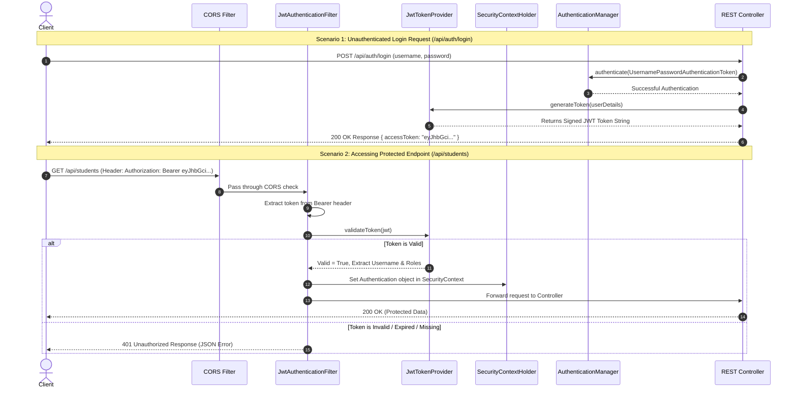

# 🛡️ Spring Boot REST API Security Masterclass & Step-by-Step Implementation Guide

> **Project:** RestApi-P1  
> **Topic:** Complete Security Architecture, Concepts ("Konsi Security Kahan aur Kyun Zaroori Hai"), and Step-by-Step Spring Security 6 / Spring Boot 3 & 4 + JWT Setup.  
> **Target Audience:** Beginners to Production-Ready Developers  

---

## 📌 Table of Contents
1. [💡 Konsi Security Kahan Aur Kyun Zaroori Hai? (Why & Where)](#1--konsi-security-kahan-aur-kyun-zaroori-hai-why--where)
2. [🏗️ Spring Security + JWT Request Architecture Flow](#2-️-spring-security--jwt-request-architecture-flow)
3. [🛠️ Step-by-Step Spring Boot Security Implementation Guide](#3-️-step-by-step-spring-boot-security-implementation-guide)
   - [Step 1: Maven Dependencies Add Karna](#step-1-maven-dependencies-add-karna)
   - [Step 2: User Entity aur Role Enum Create Karna](#step-2-user-entity-aur-role-enum-create-karna)
   - [Step 3: Password Encoding (BCrypt) Configure Karna](#step-3-password-encoding-bcrypt-configure-karna)
   - [Step 4: Custom UserDetailsService Implement Karna](#step-4-custom-userdetails-service-implement-karna)
   - [Step 5: JWT Token Utility Helper Class Banana](#step-5-jwt-token-utility-helper-class-banana)
   - [Step 6: Custom JWT Authentication Filter Create Karna](#step-6-custom-jwt-authentication-filter-create-karna)
   - [Step 7: Custom Authentication Entry Point & Access Denied Handler](#step-7-custom-authentication-entry-point--access-denied-handler)
   - [Step 8: Central SecurityFilterChain Config Class Banana](#step-8-central-securityfilterchain-config-class-banana)
   - [Step 9: Authentication DTOs aur AuthController Create Karna](#step-9-authentication-dtos-aur-authcontroller-create-karna)
   - [Step 10: Endpoints Par Role-Based Authorization (@PreAuthorize) Apply Karna](#step-10-endpoints-par-role-based-authorization-preauthorize-apply-karna)
4. [🔒 Advanced Production Security Best Practices](#4--advanced-production-security-best-practices)
5. [📋 Security Summary & Quick Checklist](#5--security-summary--quick-checklist)

---

<a name="1--konsi-security-kahan-aur-kyun-zaroori-hai-why--where"></a>
## 1. 💡 Konsi Security Kahan Aur Kyun Zaroori Hai? (Why & Where)

Aapke kisi bhi REST API project me Security **ek jagah** nahi lagti. Standard software engineering me **"Defense in Depth"** concept follow hota hai—yaani security ke multi-layers hote hain.

Agar aap security ignore karenge, toh aapka application **Data Breach**, **Unauthorized Admin Access**, **SQL Injection**, **DDoS Attacks**, aur **Session Hijacking** ke khilaf vulnerable ho jata hai.

### 📊 Master Security Matrix

| Security Layer / Concept | Kahan Lagti Hai? (Where) | Kyun Zaroori Hai? (Why) | Agar Na Lagaye Toh Kya Hoga? (Risk) |
| :--- | :--- | :--- | :--- |
| **1. Authentication (Identity)** | App Entry Point / Login API (`/api/auth/login`) | User identity verify karne ke liye ki bhejney wala sach me wohi user hai ya nahi. | Koi bhi stranger kisi bhi user ka data access ya manipulate kar sakta hai. |
| **2. Authorization & RBAC** | Controller Methods / Endpoints (`@PreAuthorize`) | Verified user ko uski permissions (Role: `ROLE_USER`, `ROLE_ADMIN`) ke mutabiq hi access dene ke liye. | Normal user `/api/admin/users` par jakar pure database ko delete kar sakta hai. |
| **3. Password Hashing (BCrypt)** | Database / Auth Service | Plain-text passwords ko irreversible encrypted hash me convert karne ke liye. | DB leak hone par hacker sabhi users ke real passwords read kar lega. |
| **4. JWT (Stateless Token)** | HTTP Request Header (`Authorization: Bearer <token>`) | REST API ko **Stateless** banane ke liye taaki server par session state store na karni pade. | Har API call par database query karni padegi ya stateful sessions ki wajah se application scaling mushkil ho jayegi. |
| **5. CORS Control** | Web Server / Security Filter | Angular/React jaise specific frontend domains ko hi API call karne ki permission dene ke liye. | Malicious third-party websites aapki REST API se user ka data fetch kar sakti hain (Browser Level Security). |
| **6. CSRF Protection** | Security Filter Chain | Stateful Session-based web apps me unauthorized commands prevent karne ke liye. | *Note:* REST APIs jaha JWT (Stateless Header) use hota hai, waha CSRF ko **Disable** kiya jata hai kyunki browser cookies send nahi hote. |
| **7. Transport Layer (HTTPS/SSL)** | Network Level / Server (`application.properties` SSL) | Client aur Server ke beech travel karne wale data ko TLS/SSL se encrypt karne ke liye. | Wi-Fi network par Man-in-the-Middle (MITM) attack se JWT Tokens aur Credentials intercept (sniff) ho jayenge. |
| **8. Input Validation & SQLi** | Controller DTOs & JPA Repositories | `@Valid`, `@NotBlank` aur Prepared Statements (Spring Data JPA) ke zariye bad data filter karne ke liye. | SQL Injection se Database wiping/drop ho sakta hai, ya invalid corrupt data DB me save ho sakta hai. |
| **9. Rate Limiting** | API Gateway / Spring Filter (Bucket4j/Resilience4j) | Per-minute maximum API requests limit karne ke liye. | DDoS Attack ya Bot Scripting se server crash ho jayega aur server bill huge ho jayega. |
| **10. Actuator Lockdown** | Spring Boot Production Metrics (`/actuator/**`) | Health checks & Metrics endpoints ko internal admins tak restricted rakhne ke liye. | Hacker `/actuator/env` ya `/actuator/heapdump` se secret keys aur DB passwords fetch kar lega. |

---

<a name="2-️-spring-security--jwt-request-architecture-flow"></a>
## 2. 🏗️ Spring Security + JWT Request Architecture Flow

Jab client (React, Mobile App, Postman) ek secured API endpoint ko request karta hai, toh Spring Boot me request is flow se guzarti hai:



---

<a name="3-️-step-by-step-spring-boot-security-implementation-guide"></a>
## 3. 🛠️ Step-by-Step Spring Boot Security Implementation Guide

Ab hum dekhenge ki step-by-step is project (`RestApi-P1`) me Spring Security aur JWT Authentication kaise integrate karenge.

---

### Step 1: Maven Dependencies Add Karna
Aapke `pom.xml` me `spring-boot-starter-security` aur Java JWT libraries (`jjwt-api`, `jjwt-impl`, `jjwt-jackson`) add karni hongi.

```xml
<!-- 1. Spring Boot Starter Security -->
<dependency>
    <groupId>org.springframework.boot</groupId>
    <artifactId>spring-boot-starter-security</artifactId>
</dependency>

<!-- 2. JSON Web Token (JJWT) Dependencies -->
<dependency>
    <groupId>io.jsonwebtoken</groupId>
    <artifactId>jjwt-api</artifactId>
    <version>0.12.5</version>
</dependency>
<dependency>
    <groupId>io.jsonwebtoken</groupId>
    <artifactId>jjwt-impl</artifactId>
    <version>0.12.5</version>
    <scope>runtime</scope>
</dependency>
<dependency>
    <groupId>io.jsonwebtoken</groupId>
    <artifactId>jjwt-jackson</artifactId>
    <version>0.12.5</version>
    <scope>runtime</scope>
</dependency>
```

> **Kyun Zaroori Hai?**  
> `spring-boot-starter-security` Spring Security core framework support deta hai. `jjwt` library JWT tokens generate aur parse/validate karne ke liye zaroori hai.

---

### Step 2: User Entity aur Role Enum Create Karna

#### A. Role Enum (`com.example.restapi.entity.Role`)
```java
package com.example.restapi.entity;

public enum Role {
    ROLE_USER,
    ROLE_ADMIN,
    ROLE_MODERATOR
}
```

#### B. User Entity (`com.example.restapi.entity.User`)
```java
package com.example.restapi.entity;

import jakarta.persistence.*;
import java.util.HashSet;
import java.util.Set;

@Entity
@Table(name = "users")
public class User {

    @Id
    @GeneratedValue(strategy = GenerationType.IDENTITY)
    private Long id;

    @Column(nullable = false, unique = true)
    private String username;

    @Column(nullable = false, unique = true)
    private String email;

    @Column(nullable = false)
    private String password;

    @ElementCollection(fetch = FetchType.EAGER)
    @CollectionTable(name = "user_roles", joinColumns = @JoinColumn(name = "user_id"))
    @Enumerated(EnumType.STRING)
    @Column(name = "role")
    private Set<Role> roles = new HashSet<>();

    public User() {}

    public User(String username, String email, String password, Set<Role> roles) {
        this.username = username;
        this.email = email;
        this.password = password;
        this.roles = roles;
    }

    // Getters and Setters
    public Long getId() { return id; }
    public void setId(Long id) { this.id = id; }

    public String getUsername() { return username; }
    public void setUsername(String username) { this.username = username; }

    public String getEmail() { return email; }
    public void setEmail(String email) { this.email = email; }

    public String getPassword() { return password; }
    public void setPassword(String password) { this.password = password; }

    public Set<Role> getRoles() { return roles; }
    public void setRoles(Set<Role> roles) { this.roles = roles; }
}
```

#### C. UserRepository (`com.example.restapi.repository.UserRepository`)
```java
package com.example.restapi.repository;

import com.example.restapi.entity.User;
import org.springframework.data.jpa.repository.JpaRepository;
import java.util.Optional;

public interface UserRepository extends JpaRepository<User, Long> {
    Optional<User> findByUsername(String username);
    Optional<User> findByEmail(String email);
    Boolean existsByUsername(String username);
    Boolean existsByEmail(String email);
}
```

---

### Step 3: Password Encoding (BCrypt) Configure Karna

Passwords ko plain-text me database me save karna sabse badi security mistake hoti hai. Iske liye hum `BCryptPasswordEncoder` use karte hain jo Salted Hash create karta hai.

```java
package com.example.restapi.config;

import org.springframework.context.annotation.Bean;
import org.springframework.context.annotation.Configuration;
import org.springframework.security.crypto.bcrypt.BCryptPasswordEncoder;
import org.springframework.security.crypto.password.PasswordEncoder;

@Configuration
public class PasswordConfig {

    @Bean
    public PasswordEncoder passwordEncoder() {
        return new BCryptPasswordEncoder(); // Default strength = 10
    }
}
```

> **Kyun Zaroori Hai?**  
> BCrypt hash ko reverse engineering dwara decrypt nahi kiya ja sakta. Har baar same password ke liye alag random salt hash generate hota hai (`$2a$10$...`), jisse Rainbow Table attacks prevent ho jate hain.

---

### Step 4: Custom UserDetailsService Implement Karna

Spring Security ko Database se user details load karne ke liye `UserDetailsService` interface implement karna hota hai.

```java
package com.example.restapi.security;

import com.example.restapi.entity.User;
import com.example.restapi.repository.UserRepository;
import org.springframework.security.core.GrantedAuthority;
import org.springframework.security.core.authority.SimpleGrantedAuthority;
import org.springframework.security.core.userdetails.UserDetails;
import org.springframework.security.core.userdetails.UserDetailsService;
import org.springframework.security.core.userdetails.UsernameNotFoundException;
import org.springframework.stereotype.Service;

import java.util.Set;
import java.util.stream.Collectors;

@Service
public class CustomUserDetailsService implements UserDetailsService {

    private final UserRepository userRepository;

    public CustomUserDetailsService(UserRepository userRepository) {
        this.userRepository = userRepository;
    }

    @Override
    public UserDetails loadUserByUsername(String usernameOrEmail) throws UsernameNotFoundException {
        User user = userRepository.findByUsername(usernameOrEmail)
                .orElseGet(() -> userRepository.findByEmail(usernameOrEmail)
                        .orElseThrow(() -> new UsernameNotFoundException("User not found with username or email: " + usernameOrEmail)));

        Set<GrantedAuthority> authorities = user.getRoles().stream()
                .map(role -> new SimpleGrantedAuthority(role.name()))
                .collect(Collectors.toSet());

        return new org.springframework.security.core.userdetails.User(
                user.getUsername(),
                user.getPassword(),
                authorities
        );
    }
}
```

---

### Step 5: JWT Token Utility Helper Class Banana

Yeh class JWT token generate, parse, aur validate karegi.

```java
package com.example.restapi.security;

import io.jsonwebtoken.*;
import io.jsonwebtoken.io.Decoders;
import io.jsonwebtoken.security.Keys;
import org.springframework.beans.factory.annotation.Value;
import org.springframework.security.core.Authentication;
import org.springframework.stereotype.Component;

import javax.crypto.SecretKey;
import java.util.Date;

@Component
public class JwtTokenProvider {

    @Value("${app.jwt.secret:404E635266556A586E3272357538782F413F4428472B4B6250645367566B5970}")
    private String jwtSecret;

    @Value("${app.jwt.expiration-milliseconds:86400000}") // 24 Hours
    private long jwtExpirationDate;

    // 1. Generate JWT Token
    public String generateToken(Authentication authentication) {
        String username = authentication.getName();
        Date currentDate = new Date();
        Date expireDate = new Date(currentDate.getTime() + jwtExpirationDate);

        return Jwts.builder()
                .subject(username)
                .issuedAt(currentDate)
                .expiration(expireDate)
                .signWith(key())
                .compact();
    }

    private SecretKey key() {
        return Keys.hmacShaKeyFor(Decoders.BASE64.decode(jwtSecret));
    }

    // 2. Extract Username from JWT Token
    public String getUsernameFromJWT(String token) {
        Claims claims = Jwts.parser()
                .verifyWith(key())
                .build()
                .parseSignedClaims(token)
                .getPayload();
        return claims.getSubject();
    }

    // 3. Validate JWT Token
    public boolean validateToken(String token) {
        try {
            Jwts.parser()
                .verifyWith(key())
                .build()
                .parseSignedClaims(token);
            return true;
        } catch (MalformedJwtException ex) {
            System.err.println("Invalid JWT token");
        } catch (ExpiredJwtException ex) {
            System.err.println("Expired JWT token");
        } catch (UnsupportedJwtException ex) {
            System.err.println("Unsupported JWT token");
        } catch (IllegalArgumentException ex) {
            System.err.println("JWT claims string is empty");
        }
        return false;
    }
}
```

---

### Step 6: Custom JWT Authentication Filter Create Karna

Yeh filter har incoming HTTP request se `Authorization: Bearer <token>` header extract karega aur validation ke baad user ko Security Context me set karega.

```java
package com.example.restapi.security;

import jakarta.servlet.FilterChain;
import jakarta.servlet.ServletException;
import jakarta.servlet.http.HttpServletRequest;
import jakarta.servlet.http.HttpServletResponse;
import org.springframework.security.authentication.UsernamePasswordAuthenticationToken;
import org.springframework.security.core.context.SecurityContextHolder;
import org.springframework.security.core.userdetails.UserDetails;
import org.springframework.security.web.authentication.WebAuthenticationDetailsSource;
import org.springframework.stereotype.Component;
import org.springframework.util.StringUtils;
import org.springframework.web.filter.OncePerRequestFilter;

import java.io.IOException;

@Component
public class JwtAuthenticationFilter extends OncePerRequestFilter {

    private final JwtTokenProvider tokenProvider;
    private final CustomUserDetailsService userDetailsService;

    public JwtAuthenticationFilter(JwtTokenProvider tokenProvider, CustomUserDetailsService userDetailsService) {
        this.tokenProvider = tokenProvider;
        this.userDetailsService = userDetailsService;
    }

    @Override
    protected void doFilterInternal(HttpServletRequest request,
                                    HttpServletResponse response,
                                    FilterChain filterChain) throws ServletException, IOException {

        // 1. Request Header se Token get karo
        String token = getJwtFromRequest(request);

        // 2. Validate Token & User Authenticate karo
        if (StringUtils.hasText(token) && tokenProvider.validateToken(token)) {
            String username = tokenProvider.getUsernameFromJWT(token);

            UserDetails userDetails = userDetailsService.loadUserByUsername(username);

            UsernamePasswordAuthenticationToken authenticationToken = new UsernamePasswordAuthenticationToken(
                    userDetails,
                    null,
                    userDetails.getAuthorities()
            );

            authenticationToken.setDetails(new WebAuthenticationDetailsSource().buildDetails(request));

            // 3. SecurityContext me Authentication Store karo
            SecurityContextHolder.getContext().setAuthentication(authenticationToken);
        }

        filterChain.doFilter(request, response);
    }

    private String getJwtFromRequest(HttpServletRequest request) {
        String bearerToken = request.getHeader("Authorization");
        if (StringUtils.hasText(bearerToken) && bearerToken.startsWith("Bearer ")) {
            return bearerToken.substring(7);
        }
        return null;
    }
}
```

---

### Step 7: Custom Authentication Entry Point & Access Denied Handler

Agar koi unauthenticated user access kare toh default HTML 403 page ki bajaye clean JSON response return karne ke liye EntryPoint custom hona chahiye.

```java
package com.example.restapi.security;

import jakarta.servlet.ServletException;
import jakarta.servlet.http.HttpServletRequest;
import jakarta.servlet.http.HttpServletResponse;
import org.springframework.security.core.AuthenticationException;
import org.springframework.security.web.AuthenticationEntryPoint;
import org.springframework.stereotype.Component;

import java.io.IOException;

@Component
public class JwtAuthenticationEntryPoint implements AuthenticationEntryPoint {

    @Override
    public void commence(HttpServletRequest request,
                         HttpServletResponse response,
                         AuthenticationException authException) throws IOException, ServletException {
        
        response.setContentType("application/json");
        response.setStatus(HttpServletResponse.SC_UNAUTHORIZED);
        response.getWriter().write("{\"status\": 401, \"error\": \"Unauthorized\", \"message\": \"" + authException.getMessage() + "\"}");
    }
}
```

---

### Step 8: Central SecurityFilterChain Config Class Banana

Spring Security 6+ me `SecurityFilterChain` Bean define kiya jata hai (`WebSecurityConfigurerAdapter` deprecate ho chuka hai).

```java
package com.example.restapi.config;

import com.example.restapi.security.JwtAuthenticationEntryPoint;
import com.example.restapi.security.JwtAuthenticationFilter;
import org.springframework.context.annotation.Bean;
import org.springframework.context.annotation.Configuration;
import org.springframework.http.HttpMethod;
import org.springframework.security.authentication.AuthenticationManager;
import org.springframework.security.config.annotation.authentication.configuration.AuthenticationConfiguration;
import org.springframework.security.config.annotation.method.configuration.EnableMethodSecurity;
import org.springframework.security.config.annotation.web.builders.HttpSecurity;
import org.springframework.security.config.http.SessionCreationPolicy;
import org.springframework.security.web.SecurityFilterChain;
import org.springframework.security.web.authentication.UsernamePasswordAuthenticationFilter;
import org.springframework.web.cors.CorsConfiguration;
import org.springframework.web.cors.CorsConfigurationSource;
import org.springframework.web.cors.UrlBasedCorsConfigurationSource;

import java.util.List;

@Configuration
@EnableMethodSecurity // Enables @PreAuthorize and @Secured
public class SecurityConfig {

    private final JwtAuthenticationEntryPoint jwtAuthenticationEntryPoint;
    private final JwtAuthenticationFilter jwtAuthenticationFilter;

    public SecurityConfig(JwtAuthenticationEntryPoint jwtAuthenticationEntryPoint,
                          JwtAuthenticationFilter jwtAuthenticationFilter) {
        this.jwtAuthenticationEntryPoint = jwtAuthenticationEntryPoint;
        this.jwtAuthenticationFilter = jwtAuthenticationFilter;
    }

    @Bean
    public AuthenticationManager authenticationManager(AuthenticationConfiguration configuration) throws Exception {
        return configuration.getAuthenticationManager();
    }

    @Bean
    public SecurityFilterChain securityFilterChain(HttpSecurity http) throws Exception {
        http
            .csrf(csrf -> csrf.disable()) // REST APIs me CSRF disable karte hain (Stateless JWT)
            .cors(cors -> cors.configurationSource(corsConfigurationSource()))
            .exceptionHandling(exception -> exception.authenticationEntryPoint(jwtAuthenticationEntryPoint))
            .sessionManagement(session -> session.sessionCreationPolicy(SessionCreationPolicy.STATELESS))
            .authorizeHttpRequests(authorize -> authorize
                // Public Endpoints
                .requestMatchers("/api/auth/**").permitAll()
                .requestMatchers("/v3/api-docs/**", "/swagger-ui/**", "/swagger-ui.html").permitAll()
                .requestMatchers(HttpMethod.GET, "/api/students/**").permitAll() // Public read access
                
                // Admin Only Endpoints
                .requestMatchers("/api/admin/**").hasRole("ADMIN")
                
                // Any other request requires authentication
                .anyRequest().authenticated()
            );

        // JWT Filter ko UsernamePasswordAuthenticationFilter se pehle add karo
        http.addFilterBefore(jwtAuthenticationFilter, UsernamePasswordAuthenticationFilter.class);

        return http.build();
    }

    @Bean
    public CorsConfigurationSource corsConfigurationSource() {
        CorsConfiguration configuration = new CorsConfiguration();
        configuration.setAllowedOrigins(List.of("http://localhost:3000", "http://localhost:4200")); // Frontend URLs
        configuration.setAllowedMethods(List.of("GET", "POST", "PUT", "DELETE", "OPTIONS"));
        configuration.setAllowedHeaders(List.of("Authorization", "Content-Type"));
        configuration.setAllowCredentials(true);

        UrlBasedCorsConfigurationSource source = new UrlBasedCorsConfigurationSource();
        source.registerCorsConfiguration("/**", configuration);
        return source;
    }
}
```

---

### Step 9: Authentication DTOs aur AuthController Create Karna

#### A. DTOs (`com.example.restapi.dto`)

**LoginDto.java**
```java
package com.example.restapi.dto;

import jakarta.validation.constraints.NotBlank;

public record LoginDto(
    @NotBlank(message = "Username or Email is required")
    String usernameOrEmail,
    
    @NotBlank(message = "Password is required")
    String password
) {}
```

**RegisterDto.java**
```java
package com.example.restapi.dto;

import jakarta.validation.constraints.Email;
import jakarta.validation.constraints.NotBlank;
import jakarta.validation.constraints.Size;

public record RegisterDto(
    @NotBlank(message = "Username is required")
    @Size(min = 3, max = 20)
    String username,

    @NotBlank(message = "Email is required")
    @Email(message = "Invalid email format")
    String email,

    @NotBlank(message = "Password is required")
    @Size(min = 6, message = "Password must be at least 6 characters")
    String password
) {}
```

**AuthResponseDto.java**
```java
package com.example.restapi.dto;

public record AuthResponseDto(
    String accessToken,
    String tokenType
) {
    public AuthResponseDto(String accessToken) {
        this(accessToken, "Bearer");
    }
}
```

#### B. AuthController (`com.example.restapi.controller.AuthController`)
```java
package com.example.restapi.controller;

import com.example.restapi.dto.AuthResponseDto;
import com.example.restapi.dto.LoginDto;
import com.example.restapi.dto.RegisterDto;
import com.example.restapi.entity.Role;
import com.example.restapi.entity.User;
import com.example.restapi.repository.UserRepository;
import com.example.restapi.security.JwtTokenProvider;
import jakarta.validation.Valid;
import org.springframework.http.HttpStatus;
import org.springframework.http.ResponseEntity;
import org.springframework.security.authentication.AuthenticationManager;
import org.springframework.security.authentication.UsernamePasswordAuthenticationToken;
import org.springframework.security.core.Authentication;
import org.springframework.security.core.context.SecurityContextHolder;
import org.springframework.security.crypto.password.PasswordEncoder;
import org.springframework.web.bind.annotation.*;

import java.util.Set;

@RestController
@RequestMapping("/api/auth")
public class AuthController {

    private final AuthenticationManager authenticationManager;
    private final UserRepository userRepository;
    private final PasswordEncoder passwordEncoder;
    private final JwtTokenProvider tokenProvider;

    public AuthController(AuthenticationManager authenticationManager,
                          UserRepository userRepository,
                          PasswordEncoder passwordEncoder,
                          JwtTokenProvider tokenProvider) {
        this.authenticationManager = authenticationManager;
        this.userRepository = userRepository;
        this.passwordEncoder = passwordEncoder;
        this.tokenProvider = tokenProvider;
    }

    @PostMapping("/login")
    public ResponseEntity<AuthResponseDto> login(@Valid @RequestBody LoginDto loginDto) {
        Authentication authentication = authenticationManager.authenticate(
                new UsernamePasswordAuthenticationToken(loginDto.usernameOrEmail(), loginDto.password())
        );

        SecurityContextHolder.getContext().setAuthentication(authentication);
        String token = tokenProvider.generateToken(authentication);

        return ResponseEntity.ok(new AuthResponseDto(token));
    }

    @PostMapping("/register")
    public ResponseEntity<String> register(@Valid @RequestBody RegisterDto registerDto) {
        if (userRepository.existsByUsername(registerDto.username())) {
            return new ResponseEntity<>("Username is already taken!", HttpStatus.BAD_REQUEST);
        }

        if (userRepository.existsByEmail(registerDto.email())) {
            return new ResponseEntity<>("Email is already registered!", HttpStatus.BAD_REQUEST);
        }

        User user = new User();
        user.setUsername(registerDto.username());
        user.setEmail(registerDto.email());
        user.setPassword(passwordEncoder.encode(registerDto.password()));
        user.setRoles(Set.of(Role.ROLE_USER));

        userRepository.save(user);

        return new ResponseEntity<>("User registered successfully!", HttpStatus.CREATED);
    }
}
```

---

### Step 10: Endpoints Par Role-Based Authorization (@PreAuthorize) Apply Karna

Ab controllers me granular authorization apply karne ke liye `@PreAuthorize` annotation ka use karenge:

```java
package com.example.restapi.controller;

import com.example.restapi.dto.StudentDto;
import com.example.restapi.service.StudentService;
import org.springframework.http.HttpStatus;
import org.springframework.http.ResponseEntity;
import org.springframework.security.access.prepost.PreAuthorize;
import org.springframework.web.bind.annotation.*;

import java.util.List;

@RestController
@RequestMapping("/api/students")
public class StudentController {

    private final StudentService studentService;

    public StudentController(StudentService studentService) {
        this.studentService = studentService;
    }

    // Public / Any Authenticated User can GET
    @GetMapping
    public ResponseEntity<List<StudentDto>> getAllStudents() {
        return ResponseEntity.ok(studentService.getAllStudents());
    }

    // Only Users with ROLE_ADMIN or ROLE_MODERATOR can CREATE
    @PreAuthorize("hasAnyRole('ADMIN', 'MODERATOR')")
    @PostMapping
    public ResponseEntity<StudentDto> createStudent(@RequestBody StudentDto studentDto) {
        return new ResponseEntity<>(studentService.createStudent(studentDto), HttpStatus.CREATED);
    }

    // Only Users with ROLE_ADMIN can DELETE
    @PreAuthorize("hasRole('ADMIN')")
    @DeleteMapping("/{id}")
    public ResponseEntity<String> deleteStudent(@PathVariable int id) {
        studentService.deleteStudent(id);
        return ResponseEntity.ok("Student deleted successfully.");
    }
}
```

---

<a name="4--advanced-production-security-best-practices"></a>
## 4. 🔒 Advanced Production Security Best Practices

Spring Security + JWT apply karne ke elawa Production environment ke liye neeche diye gaye points compulsory hote hain:

### 1. Environment Variables for Secrets
JWT Secret Key, Database Password, aur Secret Keys ko kabhi bhi `application.properties` me hardcode na karein.

**`src/main/resources/application.properties`**
```properties
# Secret from system environment variable
app.jwt.secret=${JWT_SECRET:404E635266556A586E3272357538782F413F4428472B4B6250645367566B5970}
app.jwt.expiration-milliseconds=${JWT_EXPIRATION_MS:86400000}

# Database Credentials
spring.datasource.url=${DB_URL:jdbc:mysql://localhost:3306/restapi_db}
spring.datasource.username=${DB_USERNAME:root}
spring.datasource.password=${DB_PASSWORD:secret}
```

### 2. HTTPS / SSL Enable Karna
HTTP plain-text data pass karta hai. Production me SSL certificate setup karke HTTPS enforce karein:
```properties
server.port=8443
server.ssl.key-store=classpath:keystore.p12
server.ssl.key-store-password=your_keystore_password
server.ssl.key-store-type=PKCS12
server.ssl.key-alias=tomcat
```

### 3. Rate Limiting (Resilience4j / Bucket4j)
API abuse aur Brute-Force login attempts ko rokne ke liye Bucket4j Filter use karke Login endpoint par per-minute limit lagayein (e.g., Maximum 5 login attempts per minute per IP).

### 4. Refresh Token Mechanism
Long-lived Access Tokens risky hote hain. Production architecture me:
- **Access Token Expiration:** 15 Minutes (Short-lived)
- **Refresh Token Expiration:** 7 Days (Stored securely in HttpOnly Cookie or DB)

### 5. Actuator Security Lockdown
Production me `/actuator/env` ya `/actuator/beans` open chhodna high security risk hai:
```properties
management.endpoints.web.exposure.include=health,info
management.endpoint.health.show-details=when_authorized
```

---

<a name="5--security-summary--quick-checklist"></a>
## 5. 📋 Security Summary & Quick Checklist

| Step # | Action Item | Checked? |
| :---: | :--- | :---: |
| 1 | `spring-boot-starter-security` aur `jjwt` dependencies added in `pom.xml` | 🔲 |
| 2 | `User` entity, `Role` enum, and `UserRepository` created | 🔲 |
| 3 | `BCryptPasswordEncoder` bean configured | 🔲 |
| 4 | `CustomUserDetailsService` loading user & authorities from DB | 🔲 |
| 5 | `JwtTokenProvider` helper generated with strong 256-bit secret key | 🔲 |
| 6 | `JwtAuthenticationFilter` intercepts requests and sets `SecurityContext` | 🔲 |
| 7 | `SecurityFilterChain` bean configured (CSRF disabled, Session STATELESS) | 🔲 |
| 8 | CORS configured for frontend domain origins | 🔲 |
| 9 | `/api/auth/login` and `/api/auth/register` endpoints functional | 🔲 |
| 10 | Method-level authorization (`@EnableMethodSecurity` + `@PreAuthorize`) added | 🔲 |
| 11 | Environmental variables used for all DB passwords & JWT Secrets | 🔲 |

---
*Created as part of the RestApi-P1 Enterprise Spring Boot Documentation Series.*
